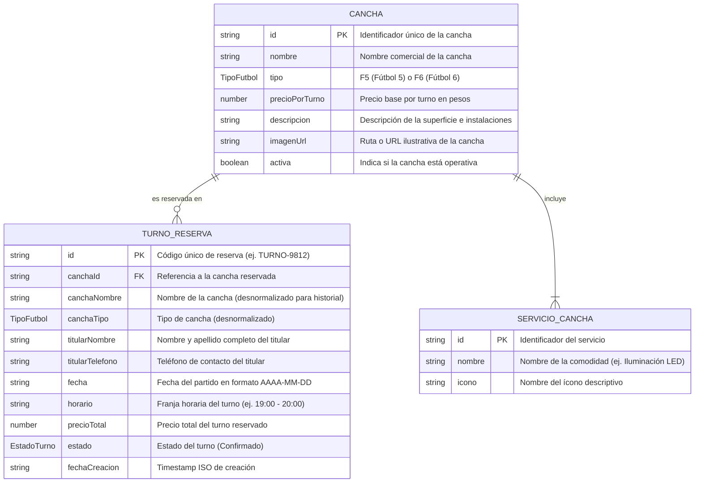
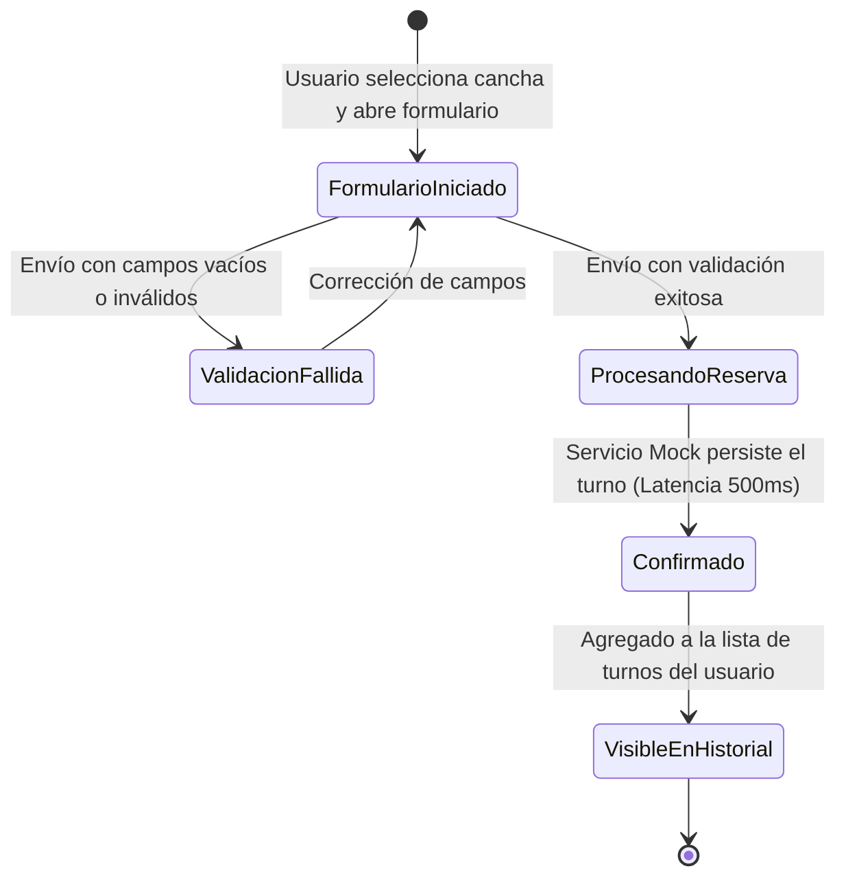

# Modelo de Datos y Entidades de Dominio: Reserva de Turnos de Fútbol

**Característica**: `001-reserva-turnos`
**Fecha**: 2026-08-18
**Estado**: Formalizado

---

## 1. Diagrama de Entidades y Relaciones



---

## 2. Definición Detallada de Entidades e Interfaces TypeScript

### 2.1. Tipo de Fútbol (`TipoFutbol`)
Enumeración estricta que clasifica la modalidad de juego de la cancha:
```typescript
export type TipoFutbol = 'Fútbol 5' | 'Fútbol 6';
```

### 2.2. Entidad Cancha (`Cancha`)
Representa una instalación deportiva habilitada en el complejo.
```typescript
export interface Cancha {
  id: string;                      // Identificador único (ej. "cancha-f5-1")
  nombre: string;                  // Nombre comercial (ej. "Cancha 1 - Monumental")
  tipo: TipoFutbol;                // 'Fútbol 5' | 'Fútbol 6'
  precioPorTurno: number;          // Precio por turno en ARS (ej. 28000)
  descripcion: string;             // Resumen de dimensiones y tipo de césped
  servicios: string[];             // Lista de comodidades incluidas
  imagenUrl?: string;              // Imagen o ilustración de la cancha
  activa: boolean;                 // Estado operativo de la cancha
}
```

**Catálogo Fijo Inicial (6 canchas configuradas en mocks)**:
1. `cancha-f5-1`: "Cancha 1 - La Bombonerita" (Fútbol 5, Sintético premium, $28.000)
2. `cancha-f5-2`: "Cancha 2 - El Monumental" (Fútbol 5, Césped sintético con caucho, $28.000)
3. `cancha-f5-3`: "Cancha 3 - El Cilindro" (Fútbol 5, Sintético techado, $30.000)
4. `cancha-f6-1`: "Cancha 4 - El Libertadores" (Fútbol 6, Césped sintético 50mm, $35.000)
5. `cancha-f6-2`: "Cancha 5 - El Coloso" (Fútbol 6, Iluminación LED profesional, $35.000)
6. `cancha-f6-3`: "Cancha 6 - La Fortaleza" (Fútbol 6, Sintético techado y ventilación, $38.000)

---

### 2.3. Entidad Turno / Reserva (`TurnoReserva`)
Representa un turno agendado por un usuario.
```typescript
export type EstadoTurno = 'Confirmado' | 'Pendiente' | 'Cancelado';

export interface TurnoReserva {
  id: string;                      // Código alfanumérico único (ej. "RES-74912")
  canchaId: string;                // ID de la cancha reservada
  canchaNombre: string;            // Nombre de la cancha
  canchaTipo: TipoFutbol;          // Tipo de fútbol
  titularNombre: string;           // Nombre completo del titular
  titularTelefono: string;         // Teléfono de contacto
  fecha: string;                   // Fecha del turno (YYYY-MM-DD)
  horario: string;                 // Franja horaria seleccionada (ej. "20:00 - 21:00")
  precioTotal: number;             // Importe total del turno
  estado: EstadoTurno;             // Estado actual de la reserva
  fechaCreacion: string;           // Fecha y hora de registro (ISO 8601)
}
```

---

### 2.4. Modelo de Datos del Formulario de Reserva (`FormularioReserva`)
Estructura de entrada capturada en la pantalla de reserva:
```typescript
export interface FormularioReserva {
  titularNombre: string;           // Obligatorio, no vacío
  titularTelefono: string;         // Obligatorio, formato telefónico
  fecha: string;                   // Obligatorio, formato YYYY-MM-DD
  horario: string;                 // Obligatorio, franja horaria seleccionada
}

export interface ErroresFormulario {
  titularNombre?: string;
  titularTelefono?: string;
  fecha?: string;
  horario?: string;
  general?: string;
}
```

---

## 3. Reglas de Validación Estricta de Negocio

| Campo | Regla de Validación | Mensaje de Error en Español |
| :--- | :--- | :--- |
| `titularNombre` | `trim().length >= 3` | "El nombre del titular es obligatorio (mínimo 3 caracteres)." |
| `titularTelefono` | `trim().length >= 6` y caracteres numéricos/guiones | "El teléfono de contacto es obligatorio y debe ser válido." |
| `fecha` | `trim().length > 0` y fecha válida no anterior al día actual | "Debe seleccionar una fecha válida para el turno." |
| `horario` | `trim().length > 0` | "Debe seleccionar una franja horaria para la reserva." |

---

## 4. Ciclo de Vida y Transiciones de Estado del Turno


